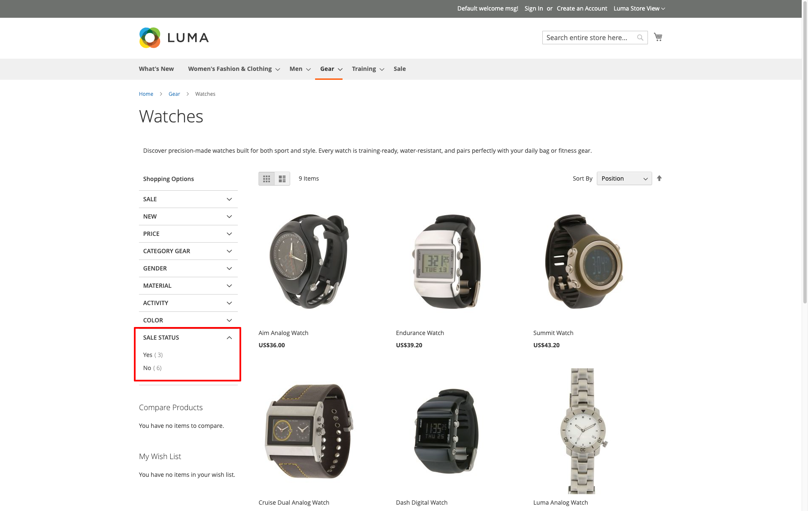
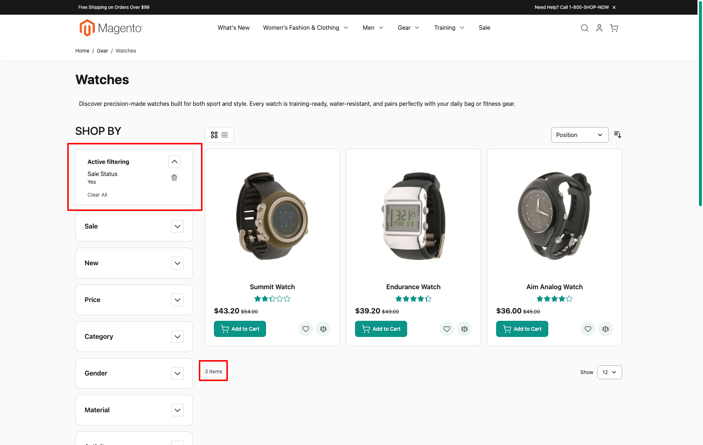
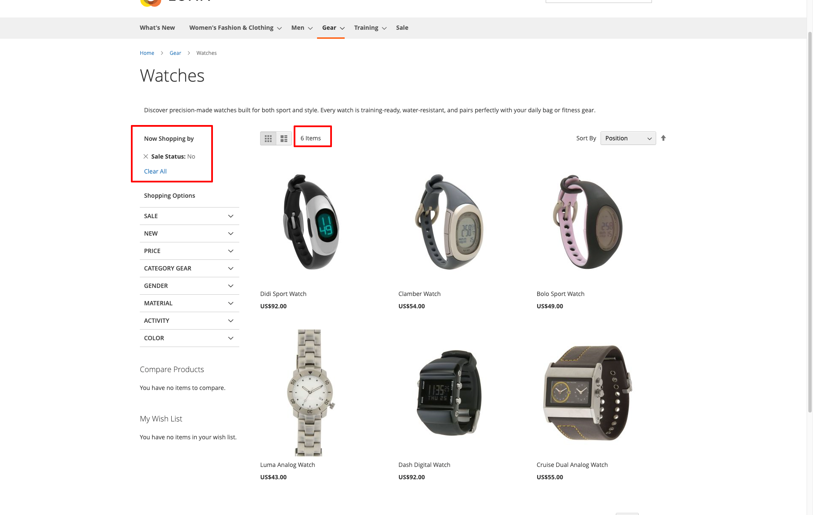
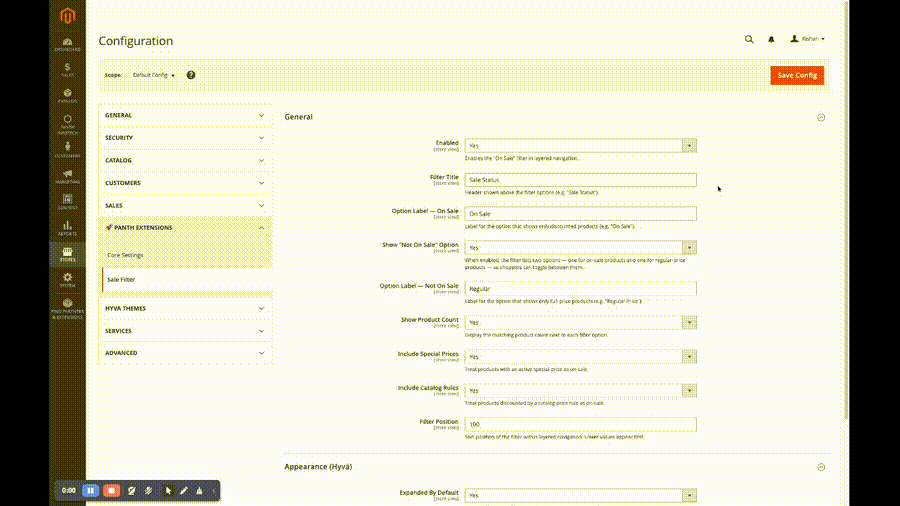
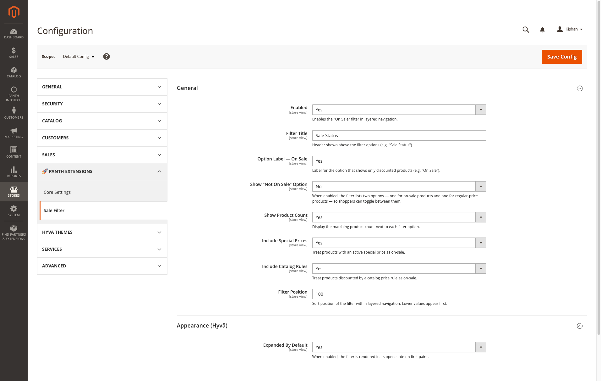
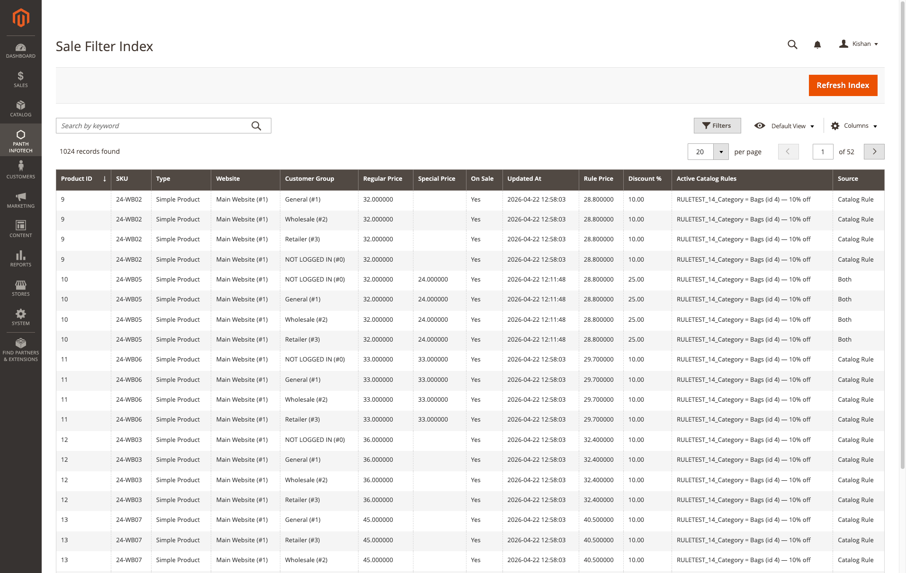
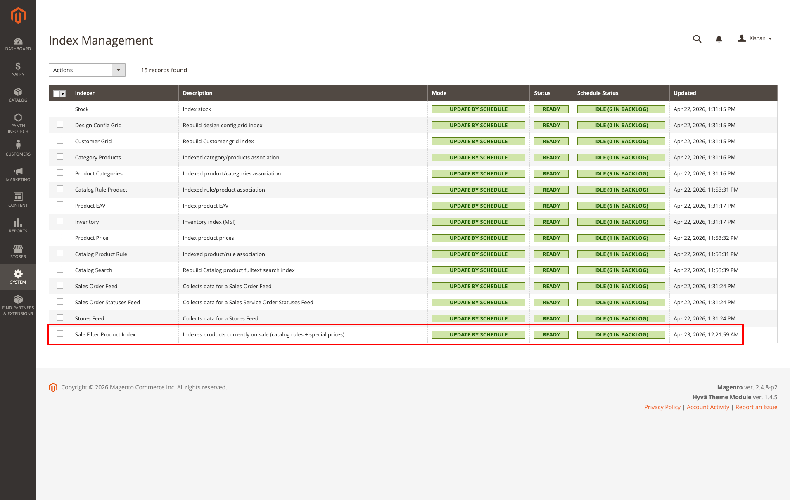

# Panth Sale Filter for Magento 2

[](https://packagist.org/packages/mage2kishan/module-sale-filter)
[](https://developer.adobe.com/commerce/)
[](https://php.net)
[](https://hyva.io/)
[](LICENSE)

A fast, indexer-driven **"On Sale"** layered-navigation filter for Magento 2 — lets shoppers narrow any category or search result to discounted products in one click.

Works on **Luma** out of the box; install the companion [`mage2kishan/module-sale-filter-hyva`](https://packagist.org/packages/mage2kishan/module-sale-filter-hyva) for a Hyvä-native Alpine.js / Tailwind template.

---

## Screenshots

### Storefront (Luma)

| Sidebar filter | Filter applied — On Sale | Filter applied — Regular |
|:---:|:---:|:---:|
|  |  |  |

### Storefront (Hyvä)


### Admin — live demo



### Admin — configuration, grid, indexer

| Configuration | Sale Filter Index grid | Indexer registration |
|:---:|:---:|:---:|
|  |  |  |

---

## Key features

- **"On Sale" and "Regular" options** in layered navigation on category and search pages.
- **Real counts** next to each option (`On Sale (12)`) — computed against the active category + visibility scope, not a global total.
- **Respects every discount mechanism** Magento ships with:
  - Catalog price rules (including dated / scheduled rules)
  - Per-product special price with start / end dates
  - Customer-group-specific pricing
  - Tier prices falling below the regular price
  - Parent aggregation for composite products (configurable / grouped / bundle) — a parent is on sale as soon as *any* eligible child is
- **Custom indexer** `panth_salefilter_product` — runs in *Update by Schedule* or *Update on Save* mode. The MView subscription tracks `catalog_product_entity_decimal`, `catalog_product_entity_datetime`, `catalogrule_product_price`, and the parent/child relation tables, so per-product saves and rule (re)applies propagate without a manual reindex.
- **Admin grid** (System → Panth Infotech → Sale Filter Index) to inspect the rows the indexer produced — per product, per customer group, per website — with filters for *on-sale only*, *match source* (`Catalog Rule` / `Special Price` / `Both`), and an *applicable rules* filter.
- **Sort-aware filtering** — price asc/desc, name asc/desc, and category position are all honoured when the filter is active. Page 1 really shows the *first* N filtered products, not the intersection of an ES page slice and the on-sale set.
- **Accurate pager totals** — the `Items 1-12 of 24` counter reflects the post-filter result even though the underlying collection is the Elasticsearch-backed `Fulltext\Collection`.
- **Cache-friendly** — every change path invalidates the `panth_salefilter`, `block_html`, and `full_page` tags so FPC entries regenerate on next hit.
- **CLI helpers** — `bin/magento panth_salefilter:reindex` for full rebuilds and `bin/magento panth_salefilter:status` for a quick health check.

---

## Compatibility

| Component | Version |
|---|---|
| Magento Open Source / Adobe Commerce | **2.4.x** (tested 2.4.4 – 2.4.8) |
| PHP | 8.1 · 8.2 · 8.3 · 8.4 |
| Search engine | Elasticsearch 7/8 · OpenSearch |
| Frontend | Luma (bundled) · Hyvä (via companion module) |

---

## Installation

```bash
composer require mage2kishan/module-sale-filter
bin/magento module:enable Panth_SaleFilter
bin/magento setup:upgrade
bin/magento setup:di:compile
bin/magento indexer:reindex panth_salefilter_product
bin/magento cache:flush
```

### Hyvä storefronts

Also install the companion module — it ships the Alpine.js / Tailwind template and the Hyvä *Appearance* admin group:

```bash
composer require mage2kishan/module-sale-filter-hyva
bin/magento module:enable Panth_SaleFilterHyva
bin/magento setup:upgrade
bin/magento setup:di:compile
bin/magento cache:flush
```

---

## Configuration

**Stores → Configuration → Panth Extensions → Sale Filter**

| Field | Notes |
|---|---|
| Enabled | Master switch. Off = filter vanishes from layered nav and `?sale_filter=…` URL params become no-ops. |
| Filter Title | Heading shown above the options (default: *Sale Status*). |
| Option Label — On Sale | Label for the discounted option (default: *On Sale* / *Yes*). |
| Show "Not On Sale" Option | When on, a second option surfaces so shoppers can toggle to regular-price products. |
| Option Label — Not On Sale | Label for the regular-price option (default: *Regular* / *No*). |
| Show Product Count | Toggles the `(12)` counter next to each option. |
| Include Special Prices | When off, the indexer ignores per-product `special_price`. |
| Include Catalog Rules | When off, the indexer ignores catalog price rules. |
| Filter Position | Sort order within layered navigation — lower = higher in the sidebar. |

All fields are store-scoped — set per store view if you need different labels per locale.

---

## How it works

1. **Indexer** `Panth\SaleFilter\Model\Indexer\ProductIndexer` walks every product × customer-group × website, resolves the effective "is on sale" flag (catalog-rule price vs special price vs regular), and writes a row into `panth_salefilter_product_index`.
2. **MView subscriptions** on `catalog_product_entity_decimal`, `catalog_product_entity_datetime`, `catalogrule_product_price`, `catalog_product_relation`, `catalog_product_super_link`, and `catalog_product_bundle_selection` keep the index fresh without a cron run.
3. **Layered-navigation plugin** runs `afterGetProductCollection` on `Catalog\Model\Layer\Category` and `Catalog\Model\Layer\Search`. It intersects the index with the current category + visibility, stashes the resulting id list on the collection, and swaps Magento's `SearchResultApplier` for a filter-aware variant so the ES page slice is *taken from* the filtered list rather than *narrowed by* it after the fact.
4. **`getSize()` plugin** returns the pre-computed post-filter count so the toolbar pager shows `N of true-total`, not `N of unfiltered`.

---

## Admin index grid

**System → Panth Infotech → Sale Filter Index** is a UI-component grid over `panth_salefilter_product_index` — useful for debugging a specific product or diffing the catalog after a rule change.

Columns: product id, SKU, type, website, customer group, regular price, special price, is-on-sale, updated-at, rule price, discount %, **active catalog rules**, and **source** (`Catalog Rule` / `Special Price` / `Both`).


---

## Indexing

`panth_salefilter_product` appears in **System → Tools → Index Management**:


### Modes

- **Update by Schedule** *(default)* — MView changelog captures changed product ids, cron (`indexer_update_all_views`) processes them.
- **Update on Save** — observers fire `reindexRow` inline on every relevant save. More DB writes during imports, but the storefront reflects changes instantly.

### CLI

```bash
# Rebuild the whole index
bin/magento indexer:reindex panth_salefilter_product
# …or the dedicated helper command
bin/magento panth_salefilter:reindex

# Quick health check
bin/magento panth_salefilter:status
bin/magento indexer:status panth_salefilter_product
```

### Dated discounts — when does the index actually refresh?

Our indexer is **event-driven**, not polling. Three triggers keep it fresh:

1. **Immediate — save observers.** A product or catalog-rule save fires `CatalogRuleSaveAfter`:
   - *Update on Save* → `$indexer->reindexRow($id)` runs synchronously in the same request.
   - *Update by Schedule* → the MView framework writes the changed ids into `panth_salefilter_product_cl`.
2. **MView changelog + Magento's indexer cron.** The `mview.xml` subscription tracks `catalog_product_entity_decimal`, `catalog_product_entity_datetime`, `catalogrule_product_price`, and the parent/child relation tables. Magento's built-in `indexer_update_all_views` cron runs **every 1 minute** — in Schedule mode it catches up to any change within ~60 seconds.
3. **Magento's daily `catalogrule_apply_all`** (from `Magento\CatalogRule\Cron\DailyCatalogUpdate`) runs at **00:00 every day**:
   - Recomputes `catalogrule_product_price` for the current date — rules whose window starts today come online, rules whose window ended yesterday drop out.
   - Fires `catalogrule_after_apply` → our observer picks it up (realtime) or the mview changelog captures the `catalogrule_product_price` inserts (schedule). Either way the `panth_salefilter_product_index` reflects the new state within a minute of midnight.

The same pattern handles **dated `special_price`**: Magento's `catalog_product_price` indexer is invalidated nightly, rebuilds, and our mview picks up the price changes it writes to `catalog_product_index_price`.

**Worst-case lag** for a discount starting / ending at a specific date: ~1 minute after midnight, bounded by the `index` cron group's schedule.

All of this requires Magento's own cron to be running (`bin/magento cron:install` + OS cron invoking `bin/magento cron:run` every minute). If cron isn't running, no Magento extension can flip dated data — not just this one.

To force an immediate re-check:

```bash
bin/magento catalog:rule:apply-all
bin/magento indexer:reindex panth_salefilter_product
```

---

## URL parameters

- `?sale_filter=1` — on-sale only
- `?sale_filter=0` — regular-price only (honoured only while *Show Not On Sale Option* is enabled)

Parameters are preserved across pagination (`&p=2`) and sort (`&product_list_order=price&product_list_dir=desc`).

---

## Uninstall

```bash
bin/magento module:disable Panth_SaleFilter
composer remove mage2kishan/module-sale-filter
bin/magento setup:upgrade
```

The `panth_salefilter_product_index` table and MView changelog are dropped automatically by `setup:upgrade` once the module is removed.

---

## Changelog

### 1.0.4
- **Fix:** *Update on Save* mode now actually reindexes on product save (previously only flagged the index as stale).

### 1.0.3
- **Fix:** honour storefront sort (position / price asc-desc / name asc-desc) while the sale filter is active.

### 1.0.2
- **Fix:** correct grid + pager total under the ES-backed `Fulltext\Collection`. Replaces the default `SearchResultApplier` with a filter-aware variant; plugs `getSize()` to return the post-filter count.

### 1.0.1
- **Fix:** count the full category, not just the visible page (toolbar pagination was leaking into the count query).

### 1.0.0
- Initial release.

---

## Support

- Issues, feature requests: <kishansavaliyakb@gmail.com>
- Author: [Kishan Savaliya](https://kishansavaliya.com)

---

## License

Proprietary. See [LICENSE](LICENSE).
