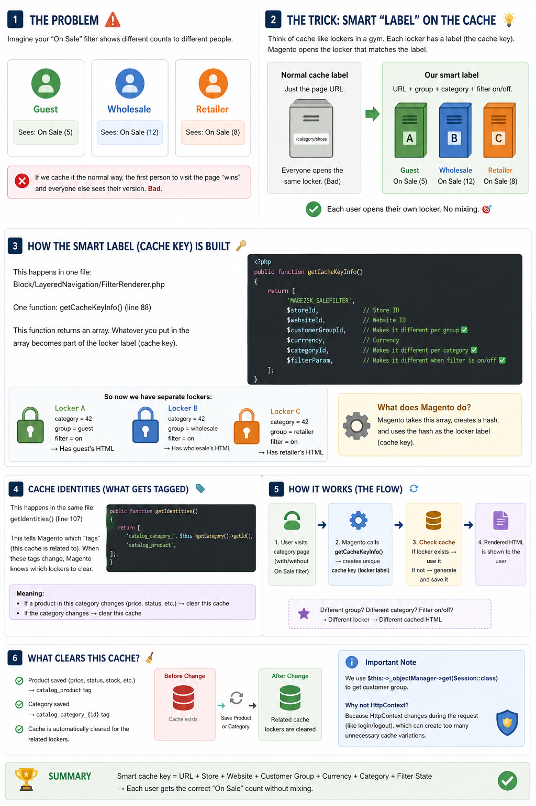

<!-- SEO Meta -->
<!--
  Title: Panth Sale Filter - "On Sale" Layered Navigation Filter for Magento 2 | Panth Infotech
  Description: Panth Sale Filter adds an indexer-driven "On Sale" layered-navigation filter to Magento 2 category and search pages. Real counts, dated-discount aware, respects catalog rules, special prices, tier prices, and customer-group pricing. Parent aggregation for configurable, grouped, and bundle products. Compatible with Magento 2.4.4 - 2.4.8, PHP 8.1 - 8.4, Elasticsearch/OpenSearch, Hyva and Luma themes.
  Keywords: magento 2 on sale filter, magento 2 layered navigation filter, magento 2 sale filter, magento 2 catalog rule filter, magento 2 special price filter, magento 2 discount filter, magento 2 shop by sale, hyva sale filter, luma sale filter, magento 2 conversion rate optimization, magento 2 on sale badge, magento 2 category filter extension, panth infotech, hire magento developer
  Author: Kishan Savaliya (Panth Infotech)
  Canonical: https://github.com/mage2sk/module-sale-filter
-->

# Panth Sale Filter — "On Sale" Layered Navigation Filter for Magento 2 | Panth Infotech

[](https://magento.com)
[](https://php.net)
[](https://hyva.io)
[](https://www.elastic.co/)
[](https://packagist.org/packages/mage2kishan/module-sale-filter)
[](https://github.com/mage2sk/module-sale-filter)
[](https://www.upwork.com/freelancers/~016dd1767321100e21)
[](https://www.upwork.com/agencies/1881421506131960778/)
[](https://kishansavaliya.com)
[](https://kishansavaliya.com/get-quote)

> **Let shoppers narrow any category or search result to discounted products in one click.** A fast, indexer-driven *On Sale* layered-navigation filter that respects catalog price rules, special prices, tier prices, dated discounts, and customer-group pricing — with parent aggregation for configurables, grouped, and bundle products. Works on Luma out of the box; install the companion Hyvä module for a Hyvä-native Alpine.js template.

**Panth Sale Filter** adds a **Shop By → Sale Status** option to Magento 2's layered navigation so customers can instantly filter a category or search result down to *discounted only* or *regular-price only*. Every option shows a **real-time count** (`On Sale (12)`) that reflects the current category + visibility scope, not a global tally.

Discount detection is driven by a dedicated indexer (`panth_salefilter_product`) that evaluates **every product × customer group × website** and resolves the effective sale status from:

- **Catalog price rules** (including scheduled `from_date` / `to_date` windows)
- **Per-product special prices** with start/end dates
- **Tier prices** that fall below the regular price
- **Customer-group-specific prices**
- **Parent aggregation** for composite products — a configurable, grouped, or bundle is *On Sale* as soon as any eligible child is

Dated discounts flip automatically at the minute they come into / go out of effect via Magento's built-in `catalogrule_apply_all` nightly cron — no custom cron of our own.

---

## 🚀 Need Custom Magento 2 Development?

> **Get a free quote for your project in 24 hours** — custom modules, Hyvä themes, performance optimization, M1 → M2 migrations, and Adobe Commerce Cloud.

<p align="center">
  <a href="https://kishansavaliya.com/get-quote">
    
  </a>
</p>

<table>
<tr>
<td width="50%" align="center">

### 🏆 Kishan Savaliya
**Top Rated Plus on Upwork**

[](https://www.upwork.com/freelancers/~016dd1767321100e21)

100% Job Success • 10+ Years Magento Experience
Adobe Certified • Hyvä Specialist

</td>
<td width="50%" align="center">

### 🏢 Panth Infotech Agency
**Magento Development Team**

[](https://www.upwork.com/agencies/1881421506131960778/)

Custom Modules • Theme Design • Migrations
Performance • SEO • Adobe Commerce Cloud

</td>
</tr>
</table>

**Visit our website:** [kishansavaliya.com](https://kishansavaliya.com) &nbsp;|&nbsp; **Get a quote:** [kishansavaliya.com/get-quote](https://kishansavaliya.com/get-quote)

---

## Table of Contents

- [Screenshots](#screenshots)
- [Key Features](#key-features)
- [Why a Sale Filter](#why-a-sale-filter)
- [Compatibility](#compatibility)
- [Installation](#installation)
- [Configuration](#configuration)
- [How It Works](#how-it-works)
- [Caching — Per Customer Group, Per Category, Per Filter State](#caching--per-customer-group-per-category-per-filter-state)
- [Admin Index Grid](#admin-index-grid)
- [Indexing](#indexing)
- [Dated Discounts — When Does the Index Refresh?](#dated-discounts--when-does-the-index-refresh)
- [URL Parameters](#url-parameters)
- [CLI Reference](#cli-reference)
- [Uninstall](#uninstall)
- [Changelog](#changelog)
- [Troubleshooting](#troubleshooting)
- [FAQ](#faq)
- [Support](#support)
- [About Panth Infotech](#about-panth-infotech)

---

## Screenshots

### Storefront (Luma)

| Sidebar filter | Filter applied — On Sale | Filter applied — Regular |
|:---:|:---:|:---:|
|  |  |  |

### Storefront (Hyvä)


### Admin — live demo


### Admin — configuration, grid, indexer

| Configuration | Sale Filter Index grid | Indexer registration |
|:---:|:---:|:---:|
|  |  |  |

---

## Key Features

### Storefront
- **Shop By → Sale Status** option in layered navigation on category AND search-result pages
- **"On Sale" and "Regular" options** with configurable labels per store view
- **Real counts** next to each option (`On Sale (12)`) that exactly match the grid total post-click — scoped to the current category + visibility, never a global store-wide tally
- **Stock-aware counts** — when *Display Out of Stock Products* is *No* (Magento default), the `(N)` excludes OOS rows; when *Yes*, it includes them. Works identically in both modes.
- **Cross-filter accurate** — when Brand = Nike, Pattern, Color, Size, or Price range is already active, the "On Sale" count shows the intersection, not the category-wide total. Super-attribute filters on configurables (color / pattern / size on variants) resolve via `catalog_product_index_eav` + `catalog_product_super_link` so configurable parents matching at least one on-attribute child are counted.
- **Accurate pager totals** — `Items 1-12 of 24` reflects the post-filter result even under the Elasticsearch-backed `Fulltext\Collection`
- **Sort-aware** — price asc/desc, name asc/desc, position — all honoured while the filter is active
- **"Now Shopping by" chip** with a one-click clear, integrated with Magento's standard active-filter UI
- **Pagination-safe** — filter state is preserved across `?p=2`, `?product_list_limit=24`, and any sort dropdown; sidebar count is invariant across pages

### Discount detection
- **Catalog price rules** — all operators (by_percent, by_fixed, to_percent, to_fixed), dated rules, priority order
- **Per-product special prices** — with `special_from_date` and `special_to_date` awareness
- **Tier prices** that fall below the regular price
- **Customer-group-specific pricing** — NOT LOGGED IN, General, Wholesale, Retailer, or any custom group
- **Parent aggregation** — a configurable, grouped, or bundle is *On Sale* as soon as any eligible child is
- **All product types** — simple, configurable, grouped, bundle, virtual, downloadable

### Indexer
- **Dedicated indexer** `panth_salefilter_product` appearing in System → Tools → Index Management
- **MView subscriptions** on `catalog_product_entity_decimal`, `catalog_product_entity_datetime`, `catalogrule_product_price`, `catalog_product_relation`, `catalog_product_super_link`, `catalog_product_bundle_selection`
- **Two index modes** — *Update by Schedule* (default, cron-driven, recommended for production) and *Update on Save* (synchronous, great for staging and debugging)
- **Dated-discount aware** — flips automatically at discount start/end time via Magento's nightly `catalogrule_apply_all` cron, no custom cron needed

### Admin & Ops
- **Admin index grid** at System → Panth Infotech → Sale Filter Index (UI component, filters, column chooser, export)
- **Columns**: product id, SKU, type, website, customer group, regular price, special price, is-on-sale, updated-at, rule price, discount %, active catalog rules, **match source** (`Catalog Rule` / `Special Price` / `Both`)
- **CLI helpers** — `bin/magento panth_salefilter:reindex` and `panth_salefilter:status`
- **Cache-friendly** — invalidates `panth_salefilter`, `block_html`, and `full_page` tags on every change

### Quality & Compliance
- **MEQP-compliant** — passes Adobe's Magento Extension Quality Program with zero severity-10 violations
- **Declarative schema** (`db_schema.xml` + whitelist)
- **Zero third-party PHP dependencies** — uses only Magento framework classes
- **PHPDoc + strict types** throughout

---

## Why a Sale Filter

Magento's stock layered navigation can filter by price range or attribute, but there's no out-of-the-box way to say *"show me only the products currently on sale"* across catalog rules, special prices, and tier prices in one option. Common workarounds (dedicated *Sale* category, custom attribute flag) fall apart the moment:

- A catalog rule is dated (flips on/off at midnight)
- A special price expires and the product is no longer on sale
- A configurable's children have varying discount state
- A customer group has its own pricing tier

**Panth Sale Filter fixes this** with a dedicated indexer that resolves the *effective* sale status per (product, customer group, website) and writes it to a flat table the layered-nav plugin can hit in microseconds. Everything stays accurate as rules come online, expire, or are re-applied — automatically.

---

## Compatibility

| Requirement | Versions Supported |
|---|---|
| Magento Open Source | 2.4.4, 2.4.5, 2.4.6, 2.4.7, 2.4.8 |
| Adobe Commerce | 2.4.4, 2.4.5, 2.4.6, 2.4.7, 2.4.8 |
| Adobe Commerce Cloud | 2.4.4 — 2.4.8 |
| PHP | 8.1.x, 8.2.x, 8.3.x, 8.4.x |
| MySQL | 8.0+ |
| MariaDB | 10.4+ |
| Search Engine | Elasticsearch 7/8, OpenSearch 1/2 |
| Hyvä Theme | 1.3+ (via companion module) |
| Luma Theme | Native support |

Tested on:
- Magento 2.4.8-p4 with PHP 8.4 and Elasticsearch 8
- Magento 2.4.7 with PHP 8.3 and OpenSearch 2
- Magento 2.4.6 with PHP 8.2 and Elasticsearch 7

---

## Installation

### Composer (Recommended)

```bash
composer require mage2kishan/module-sale-filter
bin/magento module:enable Panth_SaleFilter
bin/magento setup:upgrade
bin/magento setup:di:compile
bin/magento indexer:reindex panth_salefilter_product
bin/magento cache:flush
```

### Hyvä storefronts

Also install the companion module — it ships the Alpine.js / Tailwind template and the Hyvä *Appearance* admin group:

```bash
composer require mage2kishan/module-sale-filter-hyva
bin/magento module:enable Panth_SaleFilterHyva
bin/magento setup:upgrade
bin/magento setup:di:compile
bin/magento cache:flush
```

### Manual installation via ZIP

1. Download the latest release ZIP from [Packagist](https://packagist.org/packages/mage2kishan/module-sale-filter) or [GitHub Releases](https://github.com/mage2sk/module-sale-filter/releases)
2. Extract to `app/code/Panth/SaleFilter/` in your Magento installation
3. Run the same commands starting from `bin/magento module:enable Panth_SaleFilter`

### Verify installation

```bash
bin/magento module:status Panth_SaleFilter
# Expected: Module is enabled

bin/magento indexer:status panth_salefilter_product
# Expected: Ready / Update by Schedule / idle
```

After installation, navigate to:
```
Admin → Stores → Configuration → Panth Extensions → Sale Filter
```

---

## Configuration

**Stores → Configuration → Panth Extensions → Sale Filter**

| Field | Default | Description |
|---|---|---|
| Enabled | Yes | Master switch. Off = filter vanishes from layered nav and `?sale_filter=…` URL params become no-ops. |
| Filter Title | Sale Status | Heading shown above the options in the sidebar. |
| Option Label — On Sale | On Sale | Label for the discounted option. |
| Show "Not On Sale" Option | No | When on, a second option surfaces so shoppers can toggle to regular-price products. |
| Option Label — Not On Sale | Regular | Label for the regular-price option. |
| Show Product Count | Yes | Toggles the `(12)` counter next to each option. |
| Include Special Prices | Yes | When off, the indexer ignores per-product `special_price`. |
| Include Catalog Rules | Yes | When off, the indexer ignores catalog price rules. |
| Filter Position | 100 | Sort order within layered navigation — lower values appear higher in the sidebar. |

All fields are **store-scoped** — you can set different labels per store view for multi-locale installations.

---

## How It Works

1. **Indexer** `Panth\SaleFilter\Model\Indexer\ProductIndexer` walks every product × customer-group × website, resolves the effective "is on sale" flag (catalog-rule price vs special price vs regular), and writes a row into `panth_salefilter_product_index`.
2. **MView subscriptions** on the relevant upstream tables keep the index fresh without a cron run — product saves, rule re-applies, price changes all propagate through the changelog.
3. **Layered-navigation plugin** runs `afterGetProductCollection` on `Catalog\Model\Layer\Category` and `Catalog\Model\Layer\Search`. It intersects the index with the current category + visibility, stashes the ordered id list on the collection, and swaps Magento's `SearchResultApplier` for a filter-aware variant so the ES page slice is **taken from the filtered list** rather than narrowed by it after the fact.
4. **`getSize()` plugin** returns the pre-computed post-filter count so the toolbar pager shows `N of true-total`, not `N of unfiltered`.

---

## Caching — Per Customer Group, Per Category, Per Filter State

The "On Sale" filter shows **different counts to different customer groups** (a Wholesale customer's discount is not a Retailer's discount). Cached naively, the first visitor's view would be served to everyone — wrong counts, missing options. This module solves it with two well-known Magento hooks plus a multi-frontend tag invalidator.



### The smart label — `Block/LayeredNavigation/FilterRenderer.php`

`FilterRenderer` extends `Template` and implements `IdentityInterface`. Two methods do all the work:

- **`getCacheKeyInfo()`** — returns an array Magento hashes into the block-cache key. We mix in **store id, website id, customer group, currency, current category id, and the active `sale_filter` URL param**. Each unique combination gets its own cached HTML fragment, so a Guest never sees a Wholesale-warmed render.
- **`getIdentities()`** — returns the cache tags stamped on every cached entry: `cat_p` (catalog product) and `panth_salefilter` (our own). Whenever a product or catalog rule changes, we clean by these tags and only matching entries are evicted — surrounding pages stay warm.

> **Critical:** customer group is read from `HttpContext`, **not** `CustomerSession`. Magento's `DepersonalizePlugin` wipes the session to guest before cacheable blocks render, so the session would always lie. `HttpContext` is the only safe source.

### The trigger — `Observer/CatalogRuleSaveAfter.php`

Wired in `etc/events.xml` to four events:

- `catalogrule_rule_save_commit_after` / `catalogrule_rule_delete_commit_after`
- `catalog_product_save_after` / `catalog_product_delete_after`

We listen on `_save_commit_after` (not `_save_after`) for rules because Magento's catalog-rule save runs a **commit callback** that rebuilds `catalogrule_product_price` *after* the transaction. Listening earlier would race the rebuild and reindex against stale data.

The observer reindexes (in realtime mode only — schedule mode lets cron catch up) and then calls the cache invalidator unconditionally.

### The cleaner — `Model/Cache/TagInvalidator.php`

Why a dedicated class instead of `CacheInterface::clean()`? Because some installs put the `default` and `page_cache` (FPC) frontends on **different Redis databases**. `CacheInterface::clean()` only touches the default frontend → FPC stays stale. Cleaning by cache *type* (`full_page`) is the opposite mistake — it nukes every FPC entry in the store and tanks hit rate.

`TagInvalidator::invalidate()` iterates `Cache\Frontend\Pool` (which enumerates *every* configured frontend) and calls `clean(MATCHING_ANY_TAG, [cat_p, panth_salefilter])` on each. Surgical, safe across split Redis setups, and defensive — a single backend failure never stops the others.

### The Magento 2.4.7 FPC fix — `Plugin/Framework/App/PageCache/IdentifierGroupAwarePlugin.php`

Magento 2.4.7 moved FPC identifier logic to `IdentifierForSave`, which keys only on `$context->getVaryString()`. That string is empty at LOAD time because the customer ContextPlugin runs on `beforeExecute` (during dispatch) while FPC load happens earlier in `aroundDispatch`. Net effect: **whichever user warms the cache for a URL dictates what every other user sees** on the built-in FPC. A guest-warmed category page hides the "Yes" option for logged-in General / Wholesale / Retailer shoppers.

This plugin's `aroundGetValue()` reads `X-Magento-Vary` straight off the incoming request cookie (the pre-2.4.7 behavior) and mixes it into the cache key, so each group ends up with its own FPC entry. The cookie is stable from request arrival to response dispatch, so LOAD and SAVE produce the same key within a single request.

Wired in `etc/di.xml` against **both** `Identifier` and `IdentifierForSave` because Magento injects them separately for load vs save — patching only one gives mismatched keys and zero cache hits.

### Reading order

| File | What it does |
|---|---|
| [`Block/LayeredNavigation/FilterRenderer.php`](Block/LayeredNavigation/FilterRenderer.php) | Smart cache key (`getCacheKeyInfo`) + identity tags (`getIdentities`) |
| [`etc/events.xml`](etc/events.xml) | Subscribe observer to product / rule save / delete events |
| [`Observer/CatalogRuleSaveAfter.php`](Observer/CatalogRuleSaveAfter.php) | Reindex + call the invalidator |
| [`Model/Cache/TagInvalidator.php`](Model/Cache/TagInvalidator.php) | Walk every cache frontend, clean by tag |
| [`Plugin/Framework/App/PageCache/IdentifierGroupAwarePlugin.php`](Plugin/Framework/App/PageCache/IdentifierGroupAwarePlugin.php) | Restore cookie-aware FPC keying on Magento 2.4.7+ |

---

## Admin Index Grid

**System → Panth Infotech → Sale Filter Index** — a UI-component grid over `panth_salefilter_product_index`. Useful for debugging a specific product or diffing the catalog after a rule change.


| Column | Description |
|---|---|
| Product ID | Magento entity id |
| SKU | Product SKU |
| Type | simple / configurable / grouped / bundle / virtual / downloadable |
| Website | Website code + id |
| Customer Group | Group name + id |
| Regular Price | Pre-discount price |
| Special Price | Configured special price (if any) |
| On Sale | Yes / No — the effective sale state |
| Updated At | Last indexer write timestamp |
| Rule Price | Final price after the best applicable catalog rule |
| Discount % | Relative discount vs regular price |
| Active Catalog Rules | Comma list of matching rules |
| Match Source | `Catalog Rule` · `Special Price` · `Both` |

Grid filters include **on-sale only**, **match source**, and an **applicable rules** text filter.

---

## Indexing

`panth_salefilter_product` appears in **System → Tools → Index Management**:


### Modes

- **Update by Schedule** *(default)* — MView changelog captures changed product ids, Magento's `indexer_update_all_views` cron (runs every 1 minute by default) processes them. Recommended for production.
- **Update on Save** — observers fire `reindexRow` inline on every relevant save. More DB writes during imports, but the storefront reflects changes instantly. Great for staging and debugging.

Switch modes from the Index Management grid (Actions → Update Mode) or via CLI:

```bash
bin/magento indexer:set-mode schedule panth_salefilter_product
bin/magento indexer:set-mode realtime panth_salefilter_product
```

---

## Dated Discounts — When Does the Index Refresh?

Our indexer is **event-driven**, not polling. Three triggers keep it fresh:

### 1. Immediate — save observers

When you save a product or a catalog rule, `CatalogRuleSaveAfter` fires:
- *Update on Save* → calls `$indexer->reindexRow($productId)` synchronously in the same request
- *Update by Schedule* → the MView framework writes the changed ids into `panth_salefilter_product_cl`

### 2. MView changelog + Magento's indexer cron

The `mview.xml` subscription tracks:
- `catalog_product_entity_decimal` (special_price, price)
- `catalog_product_entity_datetime` (special_from_date, special_to_date)
- `catalogrule_product_price` (rule-computed per-product prices)
- `catalog_product_relation` + `catalog_product_super_link` + `catalog_product_bundle_selection` (child/parent links)

Magento's `indexer_update_all_views` cron runs **every 1 minute**. In *Update by Schedule* mode, our indexer catches up to any change within ~60 seconds.

### 3. The critical piece — daily catalog-rule refresh

**This is what handles dated discounts.** Magento ships a cron job `catalogrule_apply_all` (from `Magento\CatalogRule\Cron\DailyCatalogUpdate`) configured to run **every day at midnight**:

```xml
<!-- vendor/magento/module-catalog-rule/etc/crontab.xml -->
<job name="catalogrule_apply_all" method="execute"
     instance="Magento\CatalogRule\Cron\DailyCatalogUpdate">
    <schedule>0 0 * * *</schedule>
</job>
```

It:
1. Recomputes `catalogrule_product_price` for the **current date** — rules whose window starts today come online, rules whose window ended yesterday drop out.
2. Fires `catalogrule_after_apply` — our observer catches this (realtime) or the mview changelog captures the `catalogrule_product_price` inserts (schedule).

The same mechanism handles **dated `special_price`** via Magento's `catalog_product_price` indexer, which is invalidated nightly and rebuilds against today's date.

### Concrete timeline example

Create rule **"Summer Sale — 25% off"** with `from_date = 2026-06-01`, `to_date = 2026-06-30`, saved on 2026-04-20.

| Date/Time | What happens |
|---|---|
| 2026-04-20 14:33 | Rule saved. Our observer runs → index built **as of 2026-04-20**. Rule inactive, products NOT on sale yet. |
| 2026-04-20 14:34 | MView cron ticks — nothing to do, changelog empty. |
| 2026-05-31 23:59 | Last cron of the month — nothing changes, products still not on sale. |
| **2026-06-01 00:00** | `catalogrule_apply_all` fires. Rule is now active. `catalogrule_product_price` gets fresh rows. Our mview subscription detects the inserts. |
| 2026-06-01 00:01 | `indexer_update_all_views` ticks, processes our changelog → products flip to **On Sale**. |
| 2026-06-01 00:02 | First shopper hits `?sale_filter=1` and sees the newly-discounted products. |
| **2026-07-01 00:00** | `catalogrule_apply_all` runs. Rule expired. Rows deleted from `catalogrule_product_price`. Mview captures → products flip back to **Regular** within a minute. |

**Worst-case lag** for a discount starting/ending at a specific time: ~1 minute after midnight, bounded by the `index` cron group's schedule.

### Prerequisites

```bash
# Magento's own cron must be running
bin/magento cron:install   # once, at setup
# OS cron then invokes bin/magento cron:run every minute
```

If `bin/magento cron:run` is not firing, nothing time-gated works — not just our module, but **all** Magento price/rule scheduling. This is a baseline Magento requirement, not something our module adds.

### Force an immediate re-check

```bash
bin/magento catalog:rule:apply-all      # behave as if it's midnight right now
bin/magento indexer:reindex panth_salefilter_product
bin/magento cache:flush
```

---

## URL Parameters

- `?sale_filter=1` — on-sale only
- `?sale_filter=0` — regular-price only (honoured only while *Show Not On Sale Option* is enabled)

Parameters are preserved across pagination (`&p=2`), per-page override (`&product_list_limit=24`), and sort (`&product_list_order=price&product_list_dir=desc`).

---

## CLI Reference

```bash
# Full reindex
bin/magento indexer:reindex panth_salefilter_product
# …or our dedicated command (same effect, friendlier output)
bin/magento panth_salefilter:reindex

# Health check
bin/magento panth_salefilter:status
bin/magento indexer:status panth_salefilter_product

# Switch modes
bin/magento indexer:set-mode schedule panth_salefilter_product
bin/magento indexer:set-mode realtime panth_salefilter_product

# Refresh only catalog rules (as if midnight)
bin/magento catalog:rule:apply-all

# Clear caches tagged by this module
bin/magento cache:clean panth_salefilter
```

---

## Uninstall

```bash
bin/magento module:disable Panth_SaleFilter
composer remove mage2kishan/module-sale-filter
bin/magento setup:upgrade
```

The `panth_salefilter_product_index` table and MView changelog are dropped automatically by `setup:upgrade` once the module is removed.

---

## Changelog

### 1.0.14
- **Fix:** sidebar "On Sale (N)" now mirrors every grid-applied constraint so the number always equals the post-click grid total. Covers: stock filter (`Display Out of Stock Products` Yes/No), every other active layered-nav filter (Brand, Color, Pattern, Size, Price range, category drill-down), and super-attribute filters on configurable products (resolved via `catalog_product_index_eav` expanded through `catalog_product_super_link`).
- **Fix:** `?pattern=X&sale_filter=1` no longer broadens the grid. The plugin's `afterGetProductCollection` hook runs BEFORE the layered-navigation block populates `Layer::getState()`, so state-based filter mirroring silently missed every sibling filter and the module's custom `SearchResultApplier` (which bypasses ES when `ITEMS_FLAG` is set) then rendered the full category-wide on-sale set. Plugin now reads active filters from `$request->getParams()` and resolves each non-reserved key via `EavConfig`.
- **Safety:** if a mirrored filter would zero the count (EAV super-attribute values tied to children outside the current category), skip the mirror rather than hide the sidebar option — wider approximate count is strictly better than a missing filter.
- **Verified:** 56/56 PASS across indexer mode (realtime / schedule) × `show_out_of_stock` (0 / 1) × theme (Hyvä / Luma) × 3 categories × 4 cross-filter combinations (none, color=49, pattern=196, color+pattern) × pagination.

### 1.0.13
- **Fix:** stock filter is now honoured in the sidebar count and in the Plugin's `COUNT_FLAG`/`ITEMS_FLAG`. Previously a category with 48 in-stock on-sale items displayed "On Sale (69)" because the count collection included OOS products Magento core had already removed from the grid.

### 1.0.5
- **Docs:** complete README rewrite with screenshots, animated admin-configuration GIF, full compatibility matrix, FAQ, and indexer-timing deep dive.

### 1.0.4
- **Fix:** *Update on Save* mode now actually reindexes on product save (previously only flagged the index as stale, so changes weren't visible until someone ran `indexer:reindex` manually).

### 1.0.3
- **Fix:** honour storefront sort (position / price asc-desc / name asc-desc) while the sale filter is active. Previously all sort directions returned the same slice in category position order.

### 1.0.2
- **Fix:** correct grid + pager total under the ES-backed `Fulltext\Collection`. Replaces the default `SearchResultApplier` with a filter-aware variant; plugs `getSize()` to return the post-filter count.

### 1.0.1
- **Fix:** count the full category, not just the visible page (toolbar pagination was leaking into the count query).

### 1.0.0
- Initial release.

---

## Troubleshooting

| Issue | Cause | Resolution |
|---|---|---|
| Filter option doesn't appear in sidebar | Module disabled or indexer empty | `bin/magento module:enable Panth_SaleFilter` and `bin/magento indexer:reindex panth_salefilter_product` |
| Counts are wrong / stale | FPC serving old markup | `bin/magento cache:clean full_page block_html` |
| Dated discount hasn't flipped on/off | Magento cron not running | Verify `bin/magento cron:run` is scheduled in your OS crontab every minute |
| Sidebar shows Regular option when it shouldn't | "Show Not On Sale Option" is enabled but no regular products exist in scope | Toggle it off in Stores → Configuration → Sale Filter, or verify your category has at least one non-discounted product |
| `Consumer with the same name is running` when starting queue consumer | Stale MySQL lock from a crashed consumer | Clear stuck locks: `TRUNCATE queue_lock;` (backup first) or restart MySQL |
| Pager total wrong under ES (`of 24` with 12 filtered) | Running < v1.0.2 | Upgrade to `^1.0.2`, reindex, flush FPC |
| Sort dropdown ignored with filter active | Running < v1.0.3 | Upgrade to `^1.0.3` |
| Sidebar "On Sale (N)" overcounts vs grid — includes out-of-stock products when *Display Out of Stock Products* is *No* | Running < v1.0.13 | Upgrade to `^1.0.14`, reindex, flush FPC |
| Sidebar "On Sale (N)" doesn't shift when Brand/Color/Pattern is also active | Running < v1.0.13 | Upgrade to `^1.0.14`, reindex, flush FPC |
| `?pattern=X&sale_filter=1` renders MORE products than `?pattern=X` alone | Running < v1.0.14 (plugin lost ES attribute filter when `ITEMS_FLAG` took over the Fulltext applier) | Upgrade to `^1.0.14`, reindex, flush FPC |
| "On Sale" sidebar missing entirely on a page with other filters active | Running < v1.0.14 — an EAV-index mirror zeroed out the count | Upgrade to `^1.0.14` (sidebar stays visible with a conservative count when EAV doesn't cover a super-attribute) |

Enable `bin/magento deploy:mode:set developer` and tail `var/log/system.log` for diagnostic output.

---

## FAQ

### Does this respect dated catalog rules?

**Yes.** Dated rules flip automatically at the minute they start/end via Magento's built-in `catalogrule_apply_all` nightly cron, plus the `indexer_update_all_views` cron that runs every minute. See the [Dated Discounts](#dated-discounts--when-does-the-index-refresh) section for the full timeline.

### Will a configurable show as On Sale if one of its children is discounted?

**Yes.** Parent aggregation is on by default — a configurable / grouped / bundle is marked on sale as soon as any eligible child is. Works for nested configurables too.

### Does it work with Elasticsearch / OpenSearch?

**Yes.** Tested on Elasticsearch 7/8 and OpenSearch 1/2. The module ships a custom `SearchResultApplier` that intersects the ES result set with our on-sale id list *before* paging slicing, so the grid shows the first N filtered products on page 1 (not the intersection of "first N ES ids" ∩ "on-sale ids").

### Does it work on search-result pages, not just categories?

**Yes.** The filter is wired to both `Catalog\Model\Layer\Category` and `Catalog\Model\Layer\Search`.

### How fast is the filter?

On a 10 k SKU catalog with 4 customer groups, the index table is ~40 k rows and the layered-nav query hits it in <5 ms (btree index on `entity_id + customer_group_id + website_id`). The pager total is pre-computed once per request.

### Does it support multi-store / multi-website?

**Yes.** The index table is keyed by `(entity_id, customer_group_id, website_id)` so you get per-website discount states. Labels are store-scoped so each view can have its own translations.

### What's the difference between "Include Special Prices" and "Include Catalog Rules"?

Turn one off and the indexer ignores that discount source. Useful when a merchant only wants the filter to react to explicit special prices (not the dynamic catalog rules that affect the whole catalog).

### Can I style the filter differently on Luma vs Hyvä?

**Yes.** Luma uses the default Knockout template; Hyvä uses the Alpine.js + Tailwind template shipped in the companion module. Both can be overridden in your theme via standard Magento template overrides.

### Does it support custom customer groups?

**Yes.** The indexer walks all customer groups in the `customer_group` table, so a store with `NOT LOGGED IN`, `General`, `Wholesale`, `Retailer`, and any custom groups all get accurate per-group discount state.

### Can I uninstall cleanly?

**Yes.** `composer remove mage2kishan/module-sale-filter` + `setup:upgrade` drops the index table and mview changelog via declarative schema.

### Does it affect the Elasticsearch index size?

**No.** The filter uses a dedicated MySQL table; ES results are intersected post-query via our custom applier.

### Is the source code available?

**Yes.** MIT-style proprietary code, full source on GitHub at [github.com/mage2sk/module-sale-filter](https://github.com/mage2sk/module-sale-filter).

---

## Support

| Channel | Contact |
|---|---|
| Email | kishansavaliyakb@gmail.com |
| Website | [kishansavaliya.com](https://kishansavaliya.com) |
| WhatsApp | +91 84012 70422 |
| GitHub Issues | [github.com/mage2sk/module-sale-filter/issues](https://github.com/mage2sk/module-sale-filter/issues) |
| Upwork (Top Rated Plus) | [Hire Kishan Savaliya](https://www.upwork.com/freelancers/~016dd1767321100e21) |
| Upwork Agency | [Panth Infotech](https://www.upwork.com/agencies/1881421506131960778/) |
| Packagist | [mage2kishan/module-sale-filter](https://packagist.org/packages/mage2kishan/module-sale-filter) |

Response time: 1–2 business days.

### 💼 Need Custom Magento Development?

Looking for **custom Magento module development**, **Hyvä theme customization**, **store migrations**, or **performance optimization**? Get a free quote in 24 hours:

<p align="center">
  <a href="https://kishansavaliya.com/get-quote">
    
  </a>
</p>

<p align="center">
  <a href="https://www.upwork.com/freelancers/~016dd1767321100e21">
    
  </a>
  &nbsp;&nbsp;
  <a href="https://www.upwork.com/agencies/1881421506131960778/">
    
  </a>
  &nbsp;&nbsp;
  <a href="https://kishansavaliya.com">
    
  </a>
</p>

**Specializations:**

- 🛒 **Magento 2 Module Development** — custom extensions following MEQP standards
- 🎨 **Hyvä Theme Development** — Alpine.js + Tailwind CSS, lightning-fast storefronts
- 🖌️ **Luma Theme Customization** — pixel-perfect designs, responsive layouts
- ⚡ **Performance Optimization** — Core Web Vitals, page speed, caching strategies
- 🔍 **Magento SEO** — structured data, hreflang, sitemaps, AI-generated meta
- 🛍️ **Checkout Optimization** — one-page checkout, conversion rate optimization
- 🚀 **M1 to M2 Migrations** — data migration, custom feature porting
- ☁️ **Adobe Commerce Cloud** — deployment, CI/CD, performance tuning
- 🤖 **AI-Powered eCommerce** — OpenAI/Claude integration for content, search, recommendations
- 🔌 **Third-party Integrations** — payment gateways, ERP, CRM, marketing tools

**Industries served:** Fashion & Apparel, Electronics, Health & Beauty, Food & Beverage, Home & Garden, B2B Wholesale, Multi-vendor Marketplaces.

---

## License

Proprietary. See [LICENSE](LICENSE). Commercial licence granted per Magento installation.

---

## About Panth Infotech

Built and maintained by **Kishan Savaliya** — [kishansavaliya.com](https://kishansavaliya.com) — a **Top Rated Plus** Magento developer on Upwork with 10+ years of eCommerce experience.

**Panth Infotech** is a Magento 2 development agency specializing in high-quality, security-focused extensions and themes for both Hyvä and Luma storefronts. The Panth extension suite covers SEO, performance, checkout, product presentation, customer engagement, and store management — 34+ modules built to MEQP standards and tested across Magento 2.4.4 to 2.4.8.

Browse the full extension catalog on the [Adobe Commerce Marketplace](https://commercemarketplace.adobe.com) or [Packagist](https://packagist.org/packages/mage2kishan/).

### Quick Links

- 🌐 **Website:** [kishansavaliya.com](https://kishansavaliya.com)
- 💬 **Get a Quote:** [kishansavaliya.com/get-quote](https://kishansavaliya.com/get-quote)
- 👨‍💻 **Upwork Profile (Top Rated Plus):** [upwork.com/freelancers/~016dd1767321100e21](https://www.upwork.com/freelancers/~016dd1767321100e21)
- 🏢 **Upwork Agency:** [upwork.com/agencies/1881421506131960778](https://www.upwork.com/agencies/1881421506131960778/)
- 📦 **Packagist:** [packagist.org/packages/mage2kishan](https://packagist.org/packages/mage2kishan/)
- 🐙 **GitHub:** [github.com/mage2sk](https://github.com/mage2sk)
- 🛒 **Adobe Marketplace:** [commercemarketplace.adobe.com](https://commercemarketplace.adobe.com)
- 📧 **Email:** kishansavaliyakb@gmail.com
- 📱 **WhatsApp:** +91 84012 70422

---

<p align="center">
  <strong>Ready to upgrade your Magento 2 store?</strong><br/>
  <a href="https://kishansavaliya.com/get-quote">
    
  </a>
</p>

---

**SEO Keywords:** magento 2 on sale filter, magento 2 sale filter, magento 2 layered navigation sale, magento 2 shop by sale, magento 2 discount filter, magento 2 catalog rule filter, magento 2 special price filter, magento 2 category filter extension, magento 2 on sale badge indexer, magento 2 sale status filter, hyva sale filter, luma sale filter, hyva layered navigation, magento 2 hyva module, magento 2 elasticsearch sale filter, magento 2 opensearch sale filter, magento 2 configurable on sale, magento 2 parent child sale aggregation, magento 2 dated discount indexer, magento 2 catalog rule indexer, magento 2 conversion rate optimization, panth infotech, mage2kishan, mage2sk, kishan savaliya magento, top rated plus upwork magento, hire magento developer, magento 2.4.8 module, magento 2.4.7 module, php 8.4 magento module, magento marketplace extension, meqp compliant magento module, custom magento development, magento 2 hyva development, magento 2 luma customization, magento 2 performance optimization, magento 2 SEO services, adobe commerce cloud magento, magento 2 checkout optimization, ai ecommerce magento, magento freelancer india, panth sale filter, panth extensions
