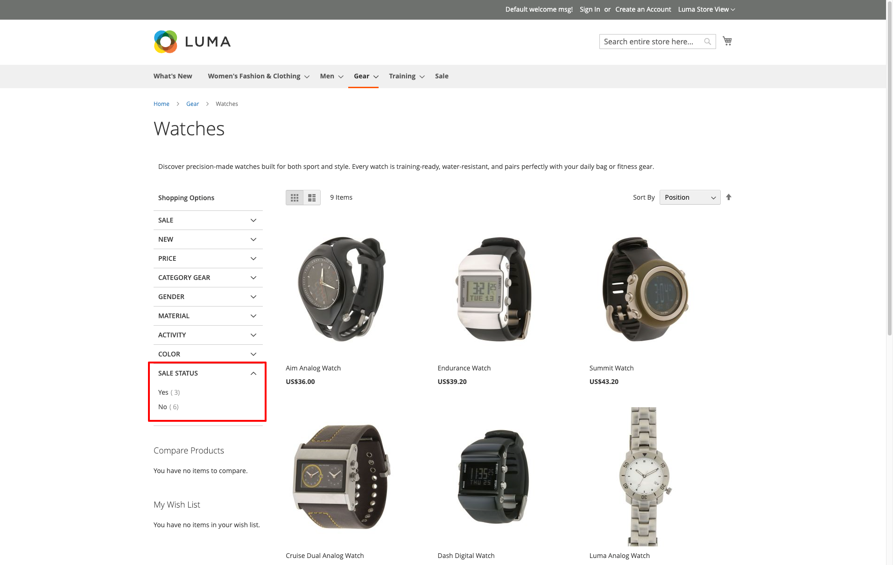
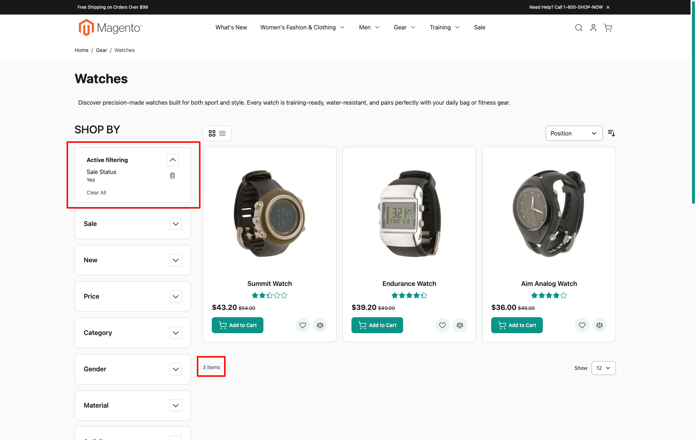
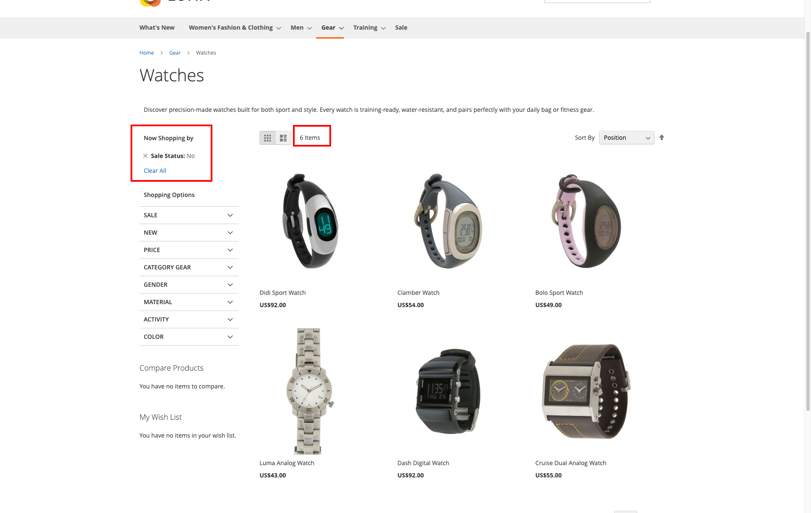
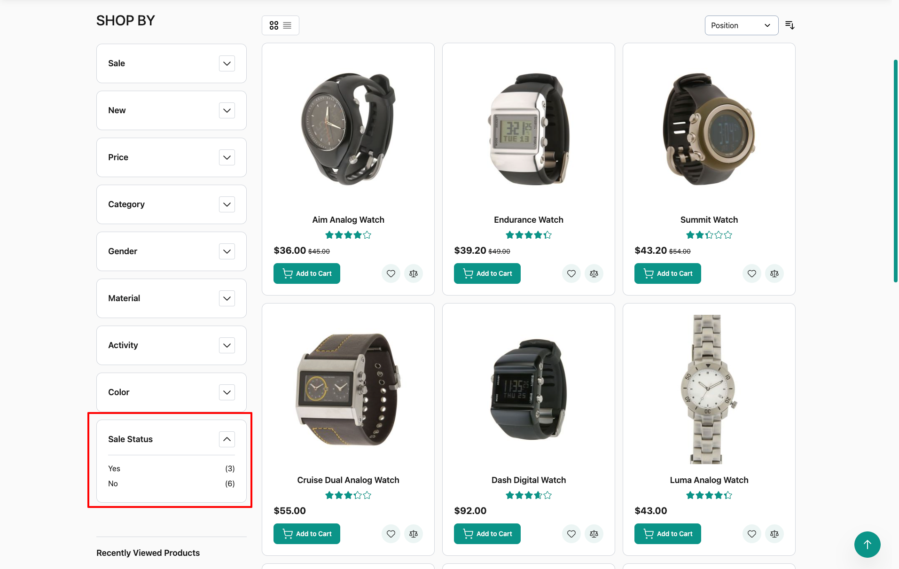
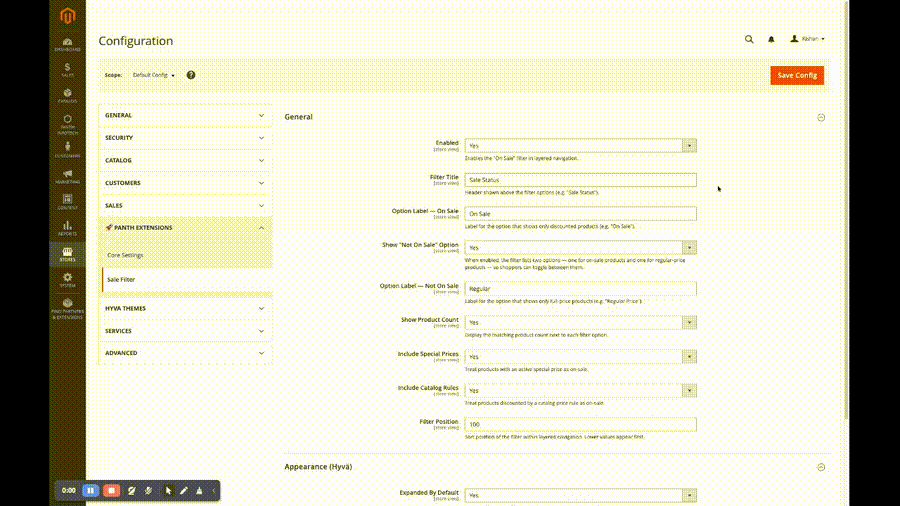
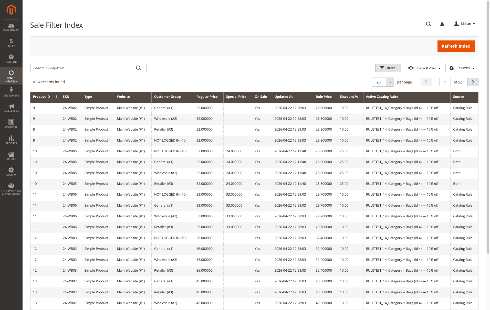
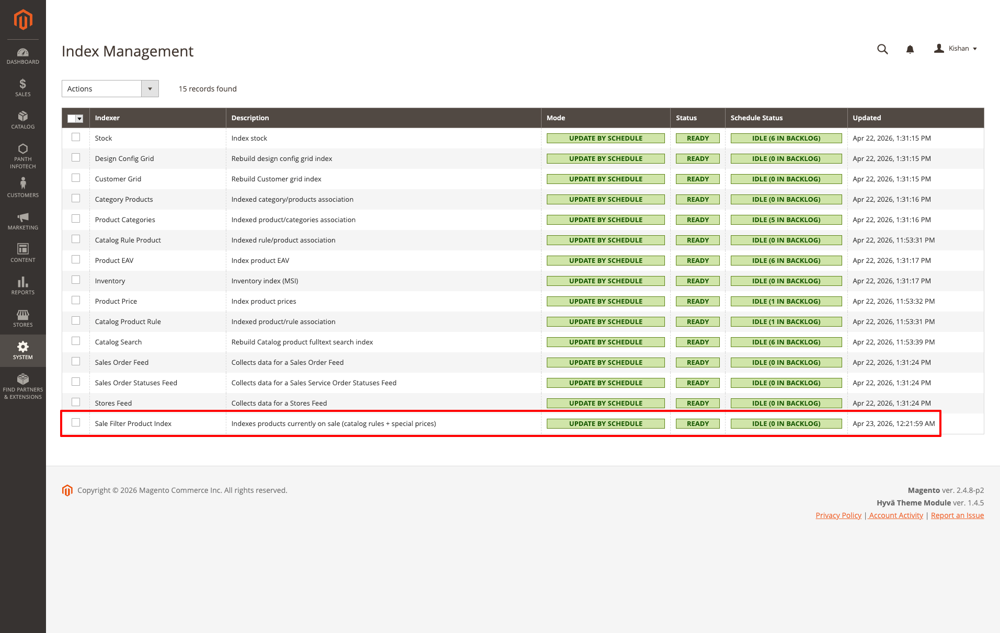
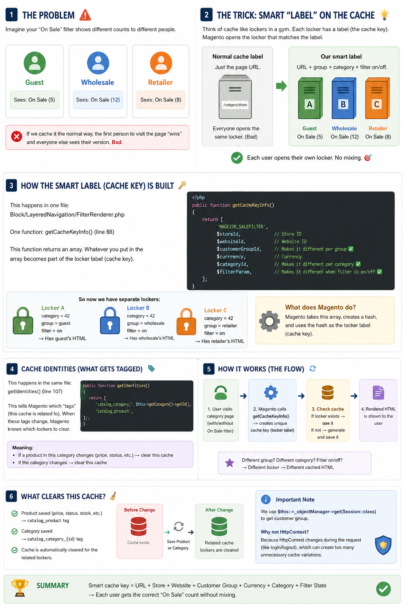

# Magento 2 Sale Filter

Panth Sale Filter adds an "On Sale" filter to Magento 2 layered navigation on category pages and catalog search result pages. Whether a product is on sale is read from a dedicated indexer that evaluates special prices and catalog price rules per website and customer group. It is meant for stores that want shoppers to narrow a listing to discounted products (and, optionally, to regular-price products). The filter sits in the theme's layered navigation block and its options are drawn by the module template `Panth_SaleFilter::layer/filter/sale.phtml` on Luma-based themes; Hyva storefronts use the companion package `mage2kishan/module-sale-filter-hyva`, which supplies its own template.

Product page: [Magento 2 Sale Filter](https://kishansavaliya.com/magento-2-sale-filter.html)

## Features

- "On Sale" option in layered navigation on category pages and search result pages.
- Optional second option for regular-price products ("Not On Sale"), off by default.
- Configurable filter title and option labels, per store view.
- Optional product count next to each option.
- On-sale detection from active special prices (with `special_from_date` / `special_to_date`) and from catalog price rules; each source can be switched off.
- Per website and per customer group results, including NOT LOGGED IN and custom groups.
- Configurable, grouped and bundle parents are marked on sale when an enabled child is on sale.
- Counts are limited to the current category (or the current search results), enabled and visible products, the stock filter, and other active layered navigation filters (price, category and filterable attributes).
- Filtered result paging and toolbar totals reflect the filtered list, not the unfiltered search result.
- Dedicated indexer `panth_salefilter_product` with MView subscriptions, supporting "Update on Save" and "Update by Schedule".
- Admin index grid with filters and a keyword search (SKU, product name, or the product ID when the keyword is a number), a "Refresh Index" button, and an admin "How It Works" page.
- CLI commands to rebuild the index and to show on-sale counts per website and customer group.
- Scoped cache cleaning: only the products whose on-sale state changed, and the categories that list them, are cleaned from the cache.
- Hourly cron that reindexes products whose special price window or catalog rule dates start or end today.
- Works with the `row_id` link field of Adobe Commerce as well as `entity_id` of Magento Open Source.

## Screenshots

Luma sidebar:



Filter applied, "On Sale" and "Regular Price":





Hyva sidebar (with the Hyva companion module):



Admin configuration:




Admin index grid and Index Management:





Cache behaviour:



## Compatibility

| Component | Supported |
|---|---|
| Magento Open Source | 2.4.4 to 2.4.8 |
| Adobe Commerce | 2.4.4 to 2.4.8 |
| PHP | 8.1, 8.2, 8.3, 8.4 |
| Themes | Luma-based themes (standard layered navigation rendering); Hyva with `mage2kishan/module-sale-filter-hyva` |

Magento constraints in `composer.json`: `magento/framework ^103.0`, `magento/module-catalog ^104.0`, `magento/module-catalog-inventory ^100.4`, `magento/module-catalog-rule ^101.2`, `magento/module-catalog-search ^102.0`, `magento/module-layered-navigation ^100.4`, `magento/module-configurable-product ^100.4`, `magento/module-grouped-product ^100.4`, `magento/module-bundle ^101.0`, `magento/module-config ^101.2`, `magento/module-customer ^103.0`, `magento/module-store ^101.1`, `magento/module-eav ^102.1`, `magento/module-backend ^102.0`, `magento/module-ui ^101.2`.

## Requirements

- Magento 2.4.4 to 2.4.8 and PHP 8.1 to 8.4.
- `mage2kishan/module-core` (module `Panth_Core`), installed automatically by Composer.
- Magento cron running, if the indexer is set to "Update by Schedule".
- For Hyva themes: `mage2kishan/module-sale-filter-hyva`. The base package lists it under `suggest` only; the Hyva package itself requires `mage2kishan/module-sale-filter` (`^1.0.9`) and `hyva-themes/magento2-default-theme` (`^1.3`).

## Installation

```bash
composer require mage2kishan/module-sale-filter
bin/magento module:enable Panth_Core Panth_SaleFilter
bin/magento setup:upgrade
bin/magento setup:di:compile
bin/magento indexer:reindex panth_salefilter_product
bin/magento cache:flush
```

`setup:di:compile` is only needed in production mode. In production mode, also deploy static content (the module ships frontend styles):

```bash
bin/magento setup:static-content:deploy -f
```

Check that the module is enabled:

```bash
bin/magento module:status Panth_SaleFilter
```

For Hyva storefronts, also install the companion package:

```bash
composer require mage2kishan/module-sale-filter-hyva
```

Then enable its module and run `setup:upgrade` and `cache:flush` again.

## Configuration

Admin path: **Stores > Configuration > Panth Extensions > Sale Filter**. The same section opens from the admin menu entry Sale Filter > Configuration. All fields can be set at default, website and store view scope.

### General

| Setting | Default | What it does |
|---|---|---|
| Enabled | Yes | Adds the filter to layered navigation. When set to No, the filter is not shown and the `sale_filter` URL parameter is ignored. |
| Filter Title | Sale Status | Heading shown above the filter options. |
| Option Label - On Sale | On Sale | Label of the option that lists discounted products. |
| Show "Not On Sale" Option | No | Adds a second option that lists regular-price products. |
| Option Label - Not On Sale | Regular Price | Label of the regular-price option. Shown only when Show "Not On Sale" Option is Yes. |
| Show Product Count | Yes | Shows the matching product count next to each option. |
| Include Special Prices | Yes | Treats products with an active special price as on sale. Used by the indexer. |
| Include Catalog Rules | Yes | Treats products discounted by a catalog price rule as on sale. Used by the indexer. |
| Filter Position | 100 | Sort position of the filter. The filter is placed before the first layered navigation filter whose attribute position is higher than this value. |

Config paths: `panth_salefilter/general/enabled`, `panth_salefilter/general/filter_label`, `panth_salefilter/general/option_label_on_sale`, `panth_salefilter/general/show_not_on_sale_option`, `panth_salefilter/general/option_label_not_on_sale`, `panth_salefilter/general/show_count`, `panth_salefilter/general/include_special_prices`, `panth_salefilter/general/include_catalog_rules`, `panth_salefilter/general/position`.

Notes:

- Include Special Prices and Include Catalog Rules are applied when the index is built. Reindex `panth_salefilter_product` after changing them. If both are No, the index is emptied and no product is on sale.
- Filter Position is compared with the position of the attributes used by the other filters. The category filter has no attribute and always stays in front. With the default of 100 the filter is usually shown last.

## Usage

### How "on sale" is determined

The indexer checks every website and every customer group and stores the on-sale products in `panth_salefilter_product_index`:

- Catalog rules: a product is on sale for a website and customer group when `catalogrule_product_price` has a row for it with today's rule date, where today is taken in the timezone of the website's default store view.
- Special prices: a product is on sale when its `special_price` is greater than 0 and lower than `price` (for bundle products, where the special price is a percentage, when it is greater than 0 and lower than 100), and the current date in the store timezone is inside `special_from_date` / `special_to_date` (an empty date is treated as open, and the whole `special_to_date` day counts as on sale). Values are read for the website's default store view: a store view value takes precedence over the global value.
- Only products enabled for the website's default store view are kept. Configurable (super link), grouped (grouped link) and bundle (bundle selection) parents of an on-sale child are also marked on sale.

Tier prices are not taken into account.

### On the storefront

- The filter uses the title from Filter Title and one or two options. An option is only shown when it has at least one matching product.
- The URL parameter is `sale_filter`: `sale_filter=1` lists on-sale products, `sale_filter=0` lists regular-price products (only when Show "Not On Sale" Option is Yes). Any other value is ignored.
- The customer group comes from the HTTP context and the website from the current store, so shoppers in different groups can see different results.
- On category pages the filtered list is built from the category's enabled, visible, in-stock products, combined with active price, category and filterable attribute filters, and sorted by position, price or name according to the toolbar.
- On search result pages the options, counts and results are limited to the products returned by the search engine for the query (up to 10000 hits), in relevance order. `sale_filter=1` keeps the on-sale products and `sale_filter=0` the regular-price products.
- The active filter appears in the "Now Shopping by" state like other layered navigation filters.
- Paging and the toolbar total use the filtered product list.
- The options are rendered by `Panth_SaleFilter::layer/filter/sale.phtml` (block `Panth\SaleFilter\Block\LayeredNavigation\FilterRenderer`, list class `panth-salefilter`) inside the theme's layered navigation filter item. Show Product Count controls the counts in this template; the core setting Catalog > Layered Navigation > Display Product Count still applies to the other filters.
- A theme or module can use another template or block for the sale filter by setting the `panth_salefilter_template` and `panth_salefilter_block` arguments on the layered navigation renderer block (`catalog.navigation.renderer` or `catalogsearch.navigation.renderer`). The block must extend `Panth\SaleFilter\Block\LayeredNavigation\FilterRenderer`. All other filters keep the theme renderer.

### Hyva

Install `mage2kishan/module-sale-filter-hyva` on Hyva storefronts. It sets the renderer arguments above in the Hyva layout handles, so its Tailwind template draws the sale filter options inside the Hyva layered navigation, and it adds the Expanded By Default setting.

### Keeping the index current

- The indexer `panth_salefilter_product` ("Sale Filter Product Index") depends on `catalogrule_product` and `catalog_product_price`.
- In "Update by Schedule" mode, MView tracks `catalogrule_product_price`, `catalog_product_entity_decimal`, `catalog_product_entity_datetime`, `catalog_product_relation`, `catalog_product_super_link` and `catalog_product_bundle_selection`, and Magento cron processes the changes.
- In "Update on Save" mode, saving or deleting a product reindexes that product (and related parents and children). Saving or deleting a catalog rule runs a full `catalogrule_rule` reindex followed by a full sale filter reindex.
- After each reindex, only the products whose on-sale state changed are cleaned from the cache: the product tags `cat_p_<id>` and the category listing tags `cat_c_p_<id>` of every category (and parent category) the products are assigned to. The clean is sent through the `clean_cache_by_tags` event, so the built-in full page cache and Varnish are both purged.
- The cron job `panth_salefilter_date_boundaries` runs every hour at minute 7. It reindexes products whose `special_from_date` or `special_to_date` falls on today or yesterday in any website timezone, and products whose catalog rule prices differ between yesterday and today. Running hourly lets every store timezone cross midnight before the next run. Magento cron must be running.

### Admin

- Sale Filter > Index Grid: listing of index rows with product ID, SKU, type, website, customer group, regular price, special price, rule price, discount %, active catalog rules, source (Special Price, Catalog Rule, Both, Parent Aggregation), on-sale flag and update time. The Refresh Index button asks for confirmation and runs a full reindex (POST request).
- Sale Filter > How It Works: help page inside the admin.

### CLI

```bash
bin/magento panth:salefilter:reindex
bin/magento panth:salefilter:reindex --force
bin/magento panth:salefilter:status
```

`panth:salefilter:reindex` runs a full rebuild; `--force` (`-f`) invalidates the indexer first. `panth:salefilter:status` shows the on-sale count per website and customer group. The standard `bin/magento indexer:reindex panth_salefilter_product` and `bin/magento indexer:set-mode` commands also work.

## Developer Notes

- Module: `Panth_SaleFilter`
- Package: `mage2kishan/module-sale-filter`
- Namespace: `Panth\SaleFilter`
- Depends on: `Panth_Core` (module sequence also lists Magento_Catalog, Magento_CatalogRule, Magento_CatalogSearch, Magento_LayeredNavigation, Magento_ConfigurableProduct, Magento_GroupedProduct, Magento_Bundle)
- Filter model: `Panth\SaleFilter\Model\Layer\Filter\SaleFilter` (request variable `sale_filter`)
- Plugins:
  - `Plugin\Catalog\Model\Layer\FilterListPlugin` on `Magento\Catalog\Model\Layer\FilterList` and `Magento\Catalog\Model\Layer\Search\FilterList` (adds the filter)
  - `Plugin\Catalog\Model\Layer\ApplySaleFilterPlugin` on `Magento\Catalog\Model\Layer\Category` and `Magento\Catalog\Model\Layer\Search` (applies `sale_filter` to the product collection)
  - `Plugin\Catalog\Model\ResourceModel\Product\GetSizePlugin` on the fulltext and catalog product collections (filtered total)
  - `Plugin\LayeredNavigation\FilterRendererPlugin` on `Magento\LayeredNavigation\Block\Navigation\FilterRenderer` (renders the sale filter with the module template)
- Preferences: `Model\ResourceModel\Fulltext\Collection\SearchResultApplier` replaces the CatalogSearch `SearchResultApplierInterface`, the CatalogSearch `SearchResultApplier` and the Elasticsearch `SearchResultApplier`.
- Full page cache: the module no longer changes the page cache identifier. Magento already varies the cache key by the `X-Magento-Vary` cookie, which carries the customer group, and keeps its own store and query parts.
- Cron: `panth_salefilter_date_boundaries` (`Cron\ReindexDateBoundaries`, group `default`).
- Observer: `Observer\CatalogRuleSaveAfter` on `catalogrule_rule_save_commit_after`, `catalogrule_rule_delete_commit_after`, `catalog_product_save_after`, `catalog_product_delete_after`.
- Indexer: `panth_salefilter_product` (`Model\Indexer\ProductIndexer`, resource `Model\ResourceModel\Indexer\ProductIndexer`), MView view `panth_salefilter_product`.
- Table: `panth_salefilter_product_index` (primary key `entity_id`, `customer_group_id`, `website_id`; foreign keys to `catalog_product_entity` and `store_website`).
- Cache tags: `panth_salefilter` on the filter block; changed products are cleaned with `cat_p_<id>` and `cat_c_p_<category id>`.
- Product links (EAV values, configurable, grouped and bundle relations) are joined on the link field from the product metadata pool (`row_id` on Adobe Commerce, `entity_id` on Magento Open Source).
- Admin route: `panth_salefilter`; UI listing `panth_salefilter_index_listing`.
- ACL: `Panth_SaleFilter::group` (under `Panth_Core::panth_extensions`) with `Panth_SaleFilter::index_grid`, `Panth_SaleFilter::index_reindex`, `Panth_SaleFilter::config`, `Panth_SaleFilter::help`.
- Patches: `Setup\Patch\Schema\DropLegacyIndexTable` drops the old `mage2sk_salefilter_product_index` table if present; `Setup\Patch\Data\ResetIndexGridBookmark` resets saved admin grid bookmarks.

## Uninstallation

If the Hyva companion is installed, remove it first, since it requires this package.

```bash
bin/magento module:disable Panth_SaleFilter
composer remove mage2kishan/module-sale-filter
bin/magento setup:upgrade
bin/magento cache:flush
```

The module has no uninstall script. Check that `panth_salefilter_product_index` and the indexer changelog table were removed, and drop them manually if they remain.

## Support

- Product page: [Magento 2 Sale Filter](https://kishansavaliya.com/magento-2-sale-filter.html)
- Contact: [kishansavaliya.com/contact](https://kishansavaliya.com/contact)
- Email: kishansavaliyakb@gmail.com
- Issues: [GitHub issues](https://github.com/mage2sk/module-sale-filter/issues)

## License

Proprietary, as declared in `composer.json`. The package is published on Packagist and can be installed with Composer; see the product page for the terms of use.

## Changelog

See [CHANGELOG.md](CHANGELOG.md).

## Links

- Website: [kishansavaliya.com](https://kishansavaliya.com)
- All extensions catalogue: [kishansavaliya.com/magento-extensions.html](https://kishansavaliya.com/magento-extensions.html)
- GitHub: [mage2sk/module-sale-filter](https://github.com/mage2sk/module-sale-filter)
- Packagist: [mage2kishan/module-sale-filter](https://packagist.org/packages/mage2kishan/module-sale-filter)
- Hyva companion: [GitHub](https://github.com/mage2sk/module-sale-filter-hyva), [Packagist](https://packagist.org/packages/mage2kishan/module-sale-filter-hyva)
